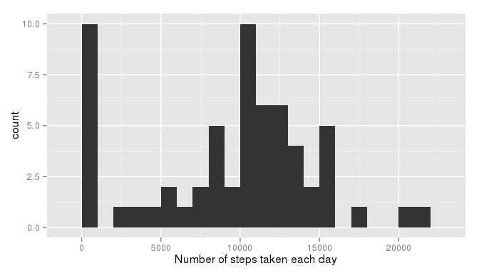
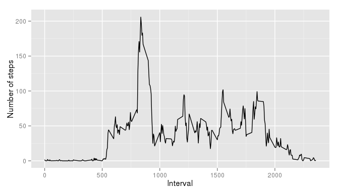
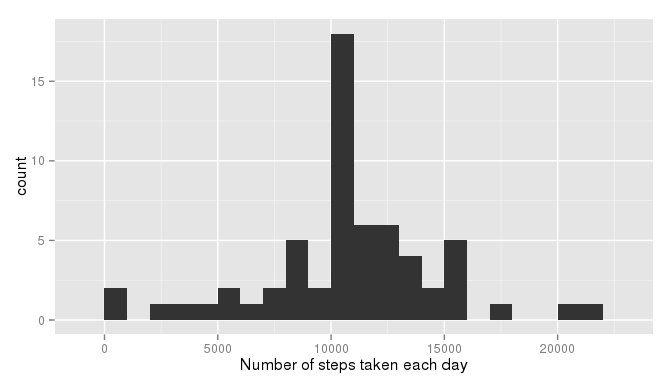
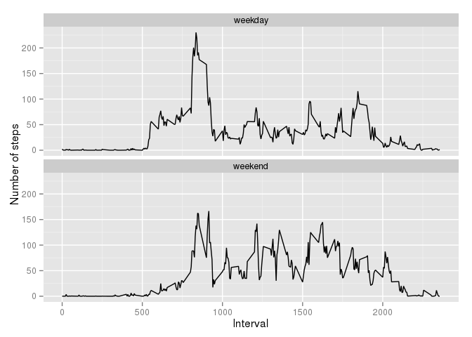

# Reproducible Research: Peer Assessment 1


## Loading and preprocessing the data
Load the "activity.zip" data file located in work dir.

```r
data <- read.csv(unz("activity.zip", "activity.csv"))
```
## Loading the required libraries

```r
library(ggplot2)
```

## What is mean total number of steps taken per day?

```r
totalSteps <- tapply(data$steps, data$date, sum, na.rm=TRUE)
qplot(totalSteps, xlab="Number of steps taken each day", binwidth=1000)
```

 

```r
mean(totalSteps, na.rm=TRUE)
```

```
## [1] 9354.23
```

```r
median(totalSteps, na.rm=TRUE)
```

```
## [1] 10395
```

## What is the average daily activity pattern?

```r
dailyAverages <- aggregate(x=list(steps=data$steps),
                           by=list(interval=data$interval),
                           mean, na.rm=TRUE)
ggplot(dailyAverages, aes(x=interval, y=steps)) +
    geom_line() +
    labs(x="Interval",
         y="Number of steps")
```

 

Identify the 5-minute interval which contains the maximum average of steps accross all days.

```r
dailyAverages[which.max(dailyAverages$steps), "interval"]
```

```
## [1] 835
```

## Imputing missing values
There are a number of days/intervals where there are missing values ("NA").

```r
missing <- is.na(data$steps)
sum(missing)
```

```
## [1] 2304
```

Fill all those missing values with the mean for that 5-minute interval.

```r
imputedData <- data
for (i in which(missing)) {  ## traverse missing-value rows
  imputedData$steps[i] <- dailyAverages$steps[dailyAverages$interval==imputedData$interval[i]]
}
```

With the imputed data set, make a new histogram of the total number of steps taken each day and calculate its mean and median values.

```r
totalSteps <- tapply(imputedData$steps, imputedData$date, sum)
qplot(totalSteps, xlab="Number of steps taken each day", binwidth=1000)
```

 

```r
mean(totalSteps)
```

```
## [1] 10766.19
```

```r
median(totalSteps)
```

```
## [1] 10766.19
```

The mean and median values are now higher than those before imputing missing data.  
It is explained by the fact that in the original data, there are some days in which the "steps" values are missing ("NA") for any interval, and the total steps for those days is interpreted as zero.  
With imputation, those missing "steps" values are replaced with the mean value of the associated "interval". The result is greater-that-zero totals for those days, which reduces the zero values and causes the mean a median to increase. 

## Are there differences in activity patterns between weekdays and weekends?
Classify the days in the imputed data set into "weekday" and "weekend".

```r
imputedData$date <- as.Date(imputedData$date)
imputedData$daytype[weekdays(imputedData$date) %in% c("Saturday", "Sunday")] <- "weekend"
imputedData$daytype[weekdays(imputedData$date) %in% c("Monday", "Tuesday", "Wednesday", "Thursday", "Friday")] <- "weekday"
```

Make a panel plot containing the average number of steps taken in each 5-minute interval, for both weekday days or weekend days.

```r
dailyAverages <- aggregate(steps ~ interval + daytype, data=imputedData, mean)
ggplot(dailyAverages, aes(x=interval, y=steps)) +
    geom_line() +
    facet_wrap(~ daytype, ncol=1) +
    labs(x="Interval",
         y="Number of steps")
```

 
